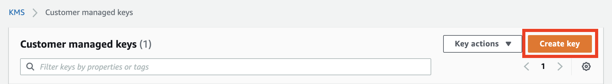
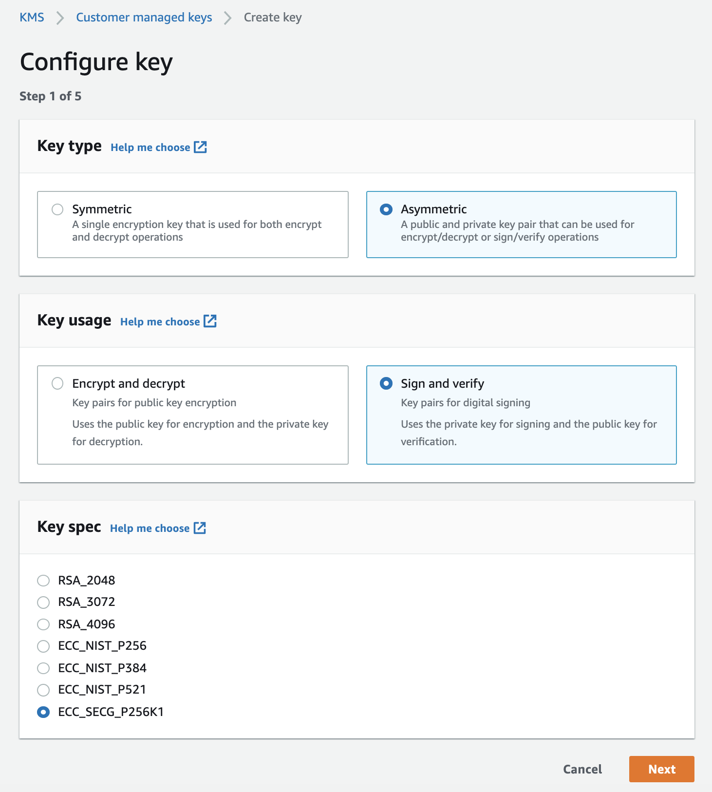
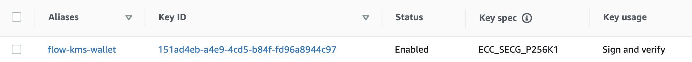
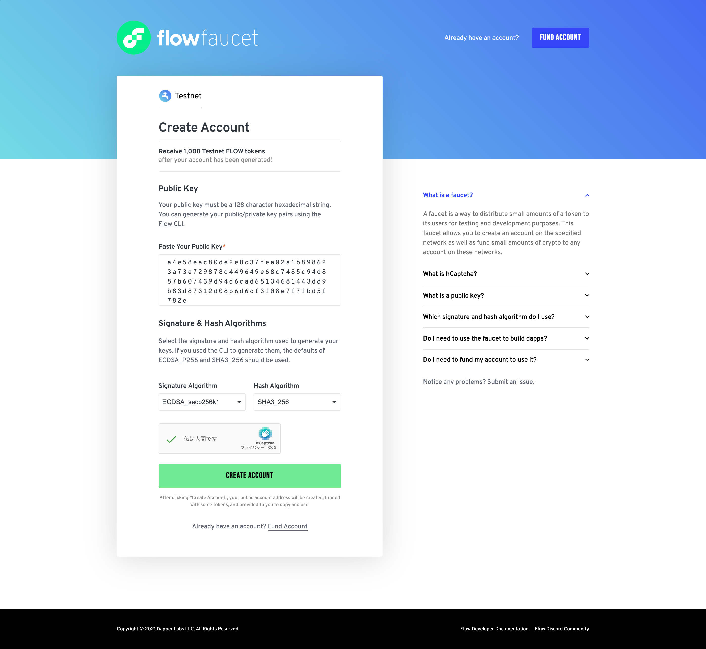

[](https://badge.fury.io/js/fcl-kms-authorizer)
[](https://github.com/doublejumptokyo/fcl-kms-authorizer/actions/workflows/test.yml)

# fcl-kms-authorizer

AWS KMS authorizer (signer) for Flow blockchain.

## Install

```bash
$ npm install fcl-kms-authorizer
```

## Examples

See [send-tx.ts](https://github.com/doublejumptokyo/fcl-kms-authorizer/blob/main/examples/send-tx.ts).

```ts
import * as fcl from "@onflow/fcl";
import { KmsAuthorizer } from "fcl-kms-authorizer";
import { fromEnv } from "@aws-sdk/credential-providers";

const region = "us-east-1";
const keyIds = ["xxxxx-xxxx-xxxx-xxxx-xxxxxxxx"];
const apiUrl = "http://localhost:8080";

fcl.config().put("accessNode.api", apiUrl);

async function main() {
  // Create an instance of the authorizer
  const authorizer = new KmsAuthorizer(
    // The first argument can be the same as the option for AWS client.
    {
      credentials: fromEnv(), // see. https://github.com/aws/aws-sdk-js-v3/tree/main/packages/credential-providers#fromenv
      region,
    },
    keyIds
  );

  // Get public key
  const publicKey = await authorizer.getPublicKey();
  console.log("publicKey:", publicKey);

  // Sign and send transactions with KMS
  //

  // `address` and `keyIndexes` obtained when the account was created.
  const address = "01cf0e2f2f715450";
  const keyIndexes = [0];

  const authorization = authorizer.authorize(address, keyIndexes);

  const response = await fcl.send([
    fcl.transaction`
      transaction {
        prepare(signer: AuthAccount) {
          log('Test transaction signed by fcl-kms-authorizer')
        }
      }
    `,
    fcl.args([]),
    fcl.proposer(authorization),
    fcl.authorizations([authorization]),
    fcl.payer(authorization),
    fcl.limit(9999),
  ]);
  await fcl.tx(response).onceSealed();

  console.log("Transaction Succeeded");

  // Sign a user message with KMS
  const signer = authorizer.getSigner();
  const signature = await signer.signUserMessage("test message");
  console.log("User Signature:", signature);
}

main().catch((e) => console.error(e));
```

## How to set up AWS KMS

Flow and this library support asymmetric keys of secp256k1. Therefore, you need to generate a key in AWS KMS with the following settings:

- Key type: `Asymmetric`
- Key usage: `Sign and verify`
- Key spec: `ECC_SECG_P256K1`





Once the key is generated, you will get the Key ID.



\* Note: These UIs are subject to change.

## How to create a Flow account

Flow blockchain requires you to create an account with this public key in advance.

Once the account is created, the address and key index are determined.

There are several ways to create an account. For details, please refer to Flow documentation.

- Using Flow CLI
  - Ref: https://docs.onflow.org/flow-cli/create-accounts
- Using Flow Testnet Faucet (for Testnet)
  - Ref: https://docs.onflow.org/dapp-deployment/testnet-deployment#creating-an-account
- Using Flow Go SDK
  - Ref: https://docs.onflow.org/flow-go-sdk/creating-accounts
- Using Flow JavaScript SDK

To obtain the public key needed to create an account, execute the following code.

```ts
// Get the public key
const publicKey = await authorizer.getPublicKey();

// -> e.g. a4e58eac80de2e8c37fea02a1b898623a73e729878d449649e68c7485c94d887b607439d94d6cad68134681443dd9b83d87312d08b6d6cf3f08e7f7fbd5f782e
```

An example of creating an account using Flow CLI is shown below:

```
# Single key
$ flow accounts create \
      --sig-algo ECDSA_secp256k1 \
      --key a4e58eac80de2e8c37fea02a1b898623a73e729878d449649e68c7485c94d887b607439d94d6cad68134681443dd9b83d87312d08b6d6cf3f08e7f7fbd5f782e

# Multiple keys
$ flow accounts create \
      --sig-algo ECDSA_secp256k1 \
      --key a4e58eac80de2e8c37fea02a1b898623a73e729878d449649e68c7485c94d887b607439d94d6cad68134681443dd9b83d87312d08b6d6cf3f08e7f7fbd5f782e,3ccefe05e593c5333f26d1642718ac4ab5d7ebb1ddf23b078e0afcb6e2e39a7c307669209124dc038348af6f61b9a70e86a8b7c384c8fd0ba4346ae3f4246cfe \
      --key-weight 1000,0
```

Also, if you want to use Flow Testnet Faucet, choose the following settings. (Note: UI is subject to change)



## Security caveats

This library is designed for backend or administrative frontend use; be careful not to expose your AWS access information to users.

With the asymmetric keys in AWS KMS, no one can steal your private key. However, please be careful not to disclose access to the signing function to anyone.
